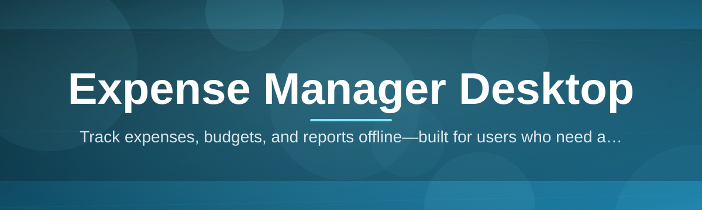

# expense-manager-desktop-suite 💸🧾

  

*A desktop-native home for every receipt, subscription, and stray coffee purchase you've ever tried to forget about.*

  

> [!TIP]
> **TL;DR**
> - 🖥️ A standalone Windows expense manager desktop app — no browser tabs, no cloud login walls, no subscription just to track your own money.
> - 📊 Built-in budgeting, category intelligence, and visual reports that actually make sense at 11pm when you're reconciling receipts.
> - ⚡ One download, zero dependency hell — double-click and you're categorizing transactions in under a minute.

---

## 🔎 Overview

`expense-manager-desktop-suite` started as a personal itch that never got scratched: every expense tracker I tried was either a bloated web app begging me to "upgrade to premium," or a spreadsheet that collapsed under its own formulas the moment I added a second bank account. So I built the expense manager desktop tool I actually wanted — something that lives on your machine, opens instantly, and treats your financial data like *your* data, not a product to be mined.

This is a passion project, full stop. It's designed for freelancers juggling client invoices, students tracking a tight monthly budget, small business owners who need clean exportable ledgers, and honestly anyone who's tired of typing numbers into a browser form that times out. Under the hood it's a native Windows desktop application — fast to launch, light on resources, and built around the idea that expense tracking software shouldn't require an internet connection to add a $4 lunch to your budget.

What makes this suite different is the focus on *offline-first* personal finance management. There's no mandatory account creation, no telemetry phoning home your grocery habits, and no paywall hiding basic reporting behind a "Pro" badge. It's the kind of tool I wanted to exist in 2026, and since nobody else was building it quite this way, I did it myself.

---

## 🧩 What's Inside the Toolbox

Rather than a wall of bullet points, here's the capability grid — think of it as the spec sheet for your new financial command center.

| Capability | What It Actually Does |
|---|---|
| **Smart Categorization Engine** | Learns your spending patterns and auto-sorts transactions into categories after just a handful of corrections — no manual tagging marathon required. |
| **Multi-Account Ledger** | Track checking, savings, credit cards, and cash envelopes side-by-side, with per-account balances that update in real time as you log entries. |
| **Visual Budget Dashboards** | Interactive charts turn raw numbers into an at-a-glance story of where your money actually went this month, not where you *think* it went. |
| **Recurring Expense Radar** | Detects subscriptions and recurring bills automatically, flagging price hikes or forgotten memberships before they quietly drain your account. |
| **Local-First Data Vault** | Every transaction lives in an encrypted local database file — nothing leaves your machine unless you export it yourself. |
| **CSV & PDF Exports** | Generate clean, shareable expense reports for tax season, reimbursements, or your accountant, formatted and ready to send. |
| **Custom Currency Support** | Handles multiple currencies with configurable exchange rates for travelers and freelancers billing across borders. |
| **Snapshot & Restore** | One-click backups so an accidental delete never turns into a full financial history wipeout. |

> [!NOTE]
> Every feature above runs entirely offline. The expense manager desktop experience was deliberately designed so you never need Wi-Fi to know how much you spent on takeout this week.

---

## 🚀 Up and Running

No installers-within-installers, no fifteen-step wizard. Here's the whole journey:

1. **Visit the landing page** using the download button above — that's the only official source for the app.
2. **Grab the latest build** for Windows 10 or 11 — pick the version that matches your setup.
3. **Launch the executable** — the suite unpacks its local database on first run and greets you with a clean, empty ledger ready for import or manual entry.
4. **Import or start fresh** — bring in an existing CSV of transactions, or just start logging expenses as they happen.

> [!IMPORTANT]
> This is a standalone desktop suite — there's no separate runtime, framework, or package manager to install beforehand. If a page asks you to run extra setup commands to use it, that's not the real project.

---

## 🖥️ System Requirements

| Requirement | Details |
|---|---|
| **OS** | Windows 10 (64-bit) or Windows 11 |
| **RAM** | 4 GB minimum, 8 GB recommended for large ledgers |
| **Disk Space** | ~250 MB free, plus space for your growing transaction history |
| **Dependencies** | None — fully self-contained, no runtime installs needed |
| **Internet** | Optional — only needed for currency rate updates and checking for new versions |

  

---

## ⚙️ How It Works

The architecture is intentionally simple — a local pipeline that turns raw entries into meaningful financial insight without ever leaving your disk.

1. **Capture** — you log a transaction manually or import a CSV batch.
2. **Classify** — the categorization engine assigns a category, learning from your past corrections.
3. **Store** — the entry is written to the encrypted local ledger database.
4. **Aggregate** — budgets and dashboards recalculate totals across accounts and time ranges.
5. **Visualize** — charts and reports render instantly, ready for review or export.

---

## 🩺 Troubleshooting

<strong>The app won't launch after downloading — what's wrong?</strong>

Windows SmartScreen sometimes flags new desktop applications it hasn't seen widely used yet. Click "More info" then "Run anyway" on the launch prompt. This is standard for indie-built executables that haven't accumulated a large download history yet.

<strong>My imported CSV shows garbled category names.</strong>

This usually means the CSV encoding isn't UTF-8. Re-save the file with UTF-8 encoding from your spreadsheet tool's export options, then re-import.

<strong>Can I sync data between two computers?</strong>

Not natively — the suite is local-first by design. You can manually copy the database file from the app's data folder onto a USB drive or cloud storage folder and open it on the second machine.

<strong>My budget totals look off after editing a past transaction.</strong>

Aggregates recalculate on the next dashboard refresh, not instantly on edit. Switch tabs or hit the refresh icon in the top toolbar to force recalculation.

<strong>Is there a way to recover deleted transactions?</strong>

Yes — if you've enabled Snapshot & Restore, open Settings → Backups and roll back to the most recent snapshot before the deletion occurred.

> [!WARNING]
> Deleting your local database file directly (outside the app) is permanent unless you've taken a snapshot beforehand. Always back up before poking around in the data folder manually.

---

## 🎨 UI / UX Details

The interface was built to feel calm, not clinical — financial software doesn't need to look like a hospital form.

- **Themes**: Light, Dark, and a high-contrast "Ledger Night" mode for late-night budget sessions.
- **Keyboard Shortcuts**:
  - `Ctrl + N` — New transaction
  - `Ctrl + F` — Quick search across all entries
  - `Ctrl + E` — Export current view
  - `Ctrl + B` — Open budget dashboard
  - `Esc` — Close active modal
- **Settings**: Configurable default currency, fiscal month start day, category color mapping, and auto-backup frequency.

> [!TIP]
> Pin frequently used categories to the sidebar via right-click → "Pin Category" — it trims down repetitive scrolling during rapid entry sessions.

---

## 🤝 Contributing & Community

This project grew from a solo passion build into something a small but enthusiastic community now helps shape. Bug reports, feature suggestions, and pull requests are genuinely welcome — this expense manager desktop tool only gets sharper with more real-world usage feedback.

- Open an issue for bugs or ideas — screenshots of your ledger setup help a ton.
- Fork and submit a pull request for fixes or new report types.
- Join discussions to vote on which feature gets prioritized next.

> [!NOTE]
> There's no formal roadmap tyranny here — priorities shift based on what actual users need most, not a rigid corporate backlog.

---

## 📜 License

Released under the [MIT License](LICENSE), 2026. Use it, fork it, remix it into your own budgeting workflow — just keep the license notice intact.

---

## ⚠️ Disclaimer

This software is provided as-is, without warranty of any kind. It is intended as a personal finance organization tool, not professional financial, tax, or accounting advice. Always consult a qualified professional for decisions involving taxes, investments, or business accounting. The maintainers are not liable for financial decisions made based on data generated by this application.

---

